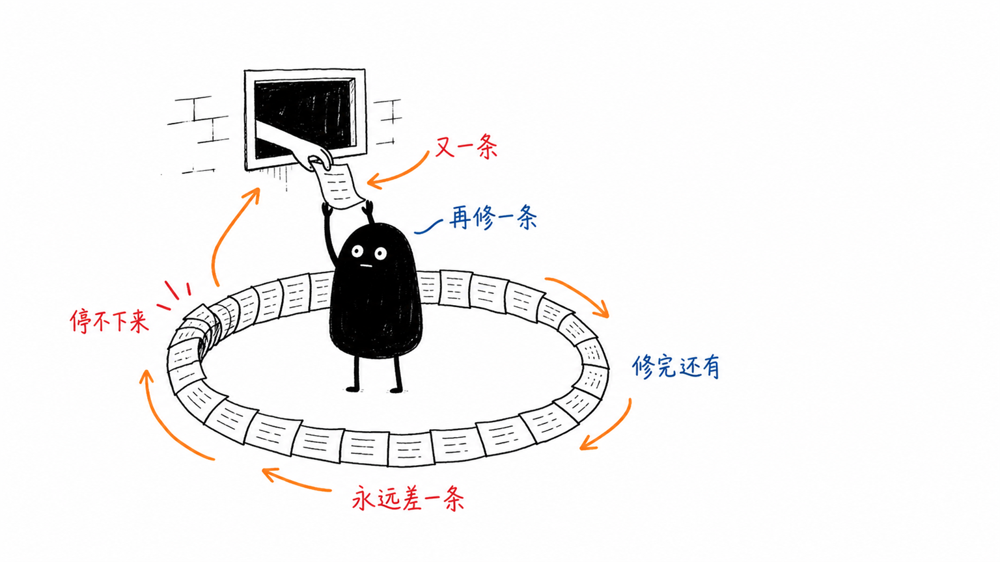
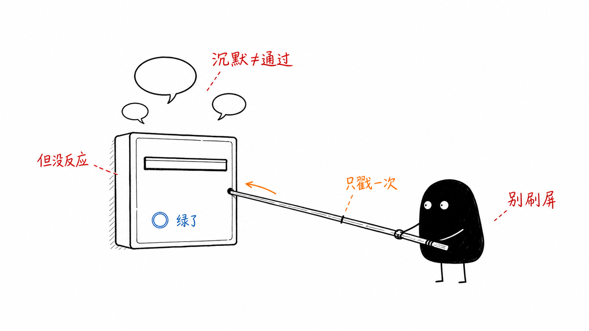
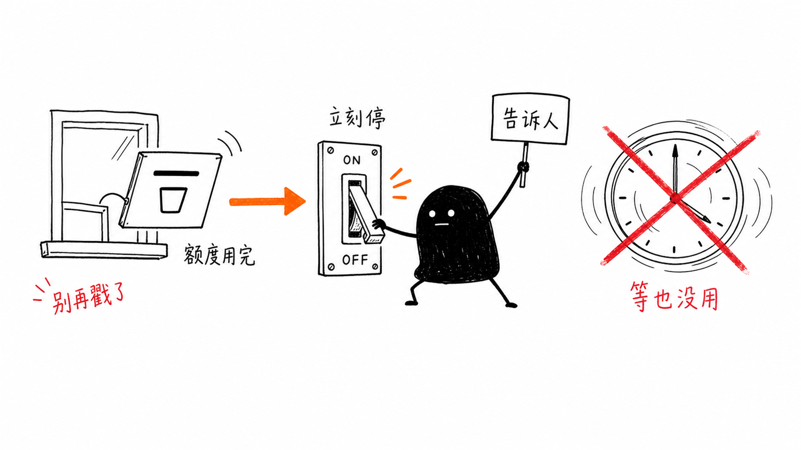
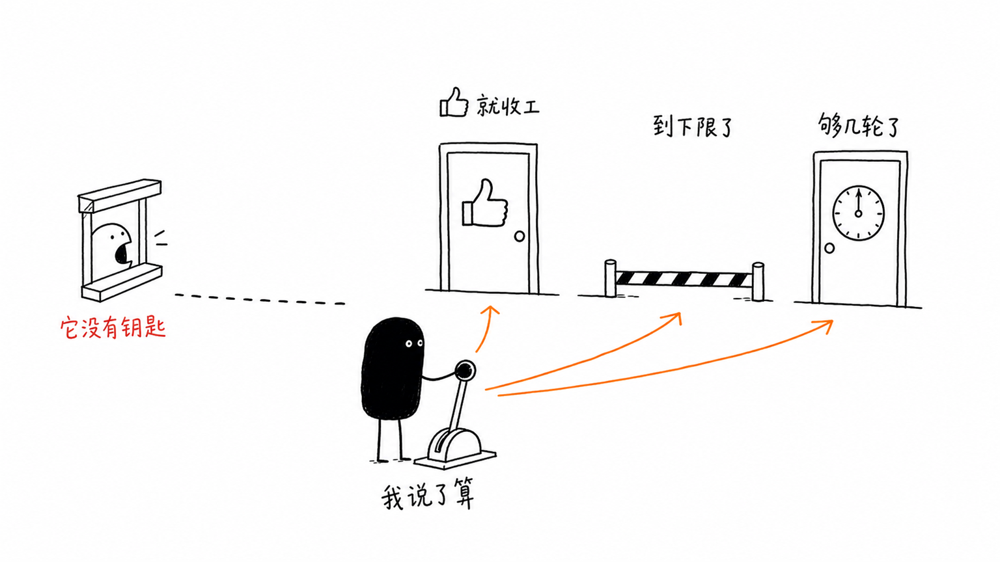
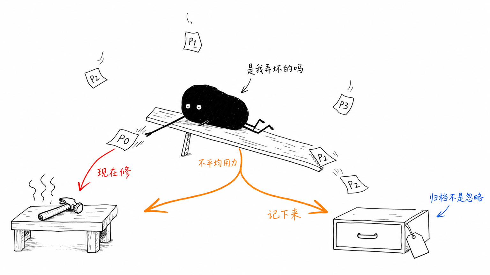

<h1 align="center">codex-review-loop</h1>

[中文](README.md) | English

> 🔁 Watch Codex's review, fix what needs fixing, stop where it should stop

<!-- Once skills.sh indexes this repo (https://www.skills.sh/proem/codex-review-loop returns 200), swap the static badge for the live install count:  -->
<p align="center">
<a href="https://skills.sh/proem/codex-review-loop"></a>
<a href="LICENSE"></a>
</p>

Watch a GitHub PR (pull request — one proposed batch of code changes) for Codex AI review, fix each finding in-loop, and stop at a sensible point — either Codex's 👍, or your own call that nothing important is left — instead of chasing nitpicks, the kind of minor comment nothing breaks without, forever.

<p align="center">

</p>

## What it is

`codex-review-loop` is a [Claude Code](https://claude.com/claude-code) skill (also packaged as a Codex plugin via `.codex-plugin/plugin.json`) that shepherds a pull request through [OpenAI Codex's](https://openai.com/index/introducing-codex/) GitHub review bot (`chatgpt-codex-connector[bot]`): it monitors for new review activity, authors a fix for each finding, marks the thread (one comment discussion on the PR) resolved, and decides — on its own authority, not the bot's — when the PR is done.

## Why

Codex can always surface one more nitpick, and auto-review-on-push is unreliable (it routinely leaves a commit with no reaction at all). Left unmanaged, that turns into either an infinite review loop chasing a 👍 that never comes, or a PR silently stalled because nobody noticed the bot went quiet. This skill closes both gaps mechanically.

## Key ideas

- **Self-healing monitor** — a single GraphQL query per poll cycle watches reviews, inline findings, PR-issue comments, the 👍 reaction, and CI (the builds and tests that run automatically) together. If the head commit — the newest commit on the branch — goes CI-green, meaning every automated check passed, with no Codex reaction, the monitor auto-posts one `@codex review` nudge per unreviewed head — no human has to notice the stall.

  <p align="center">
  
  </p>

- **Quota-aware auto-exit** — if Codex replies with an explicit usage/quota-limit message instead of a review, the monitor detects it mechanically, prints `[BLOCKED:QUOTA]`, and exits the watch itself rather than leaving that fact buried in routine polling output.

  <p align="center">
  
  </p>

- **Stopping authority stays with you, not the bot.** Three legal exits, any one of which ends the loop:
  1. Codex's 👍.
  2. You judge that the **severity floor** — the line below which nothing left is worth another round — is reached: no unresolved P0, no unresolved P1 on the code path your change touched, and no regression (something that worked fine before your change broke it). Everything else gets archived as a follow-up issue: a to-do item filed for later.
  3. A **round cap** — a hard limit on how many rounds the loop runs — as a backstop against Codex endlessly re-filing the same nitpicks.

  <p align="center">
  
  </p>

- **A P0–P3 decision table** — Codex tags each comment with a severity, and the table turns that tag into fix-in-PR versus file-as-follow-up.

  | Tag | What it means |
  | --- | --- |
  | **P0** | Something that will actually break: a crash, wrong data, a security hole. Fix in this PR. |
  | **P1** | A real problem, less urgent. Fix it if it sits on the path your change touched; otherwise file it. |
  | **P2** | A suggested improvement. Archive by default. |
  | **P3** | Style, naming, nitpick territory. Archive by default. |

  <p align="center">
  
  </p>

- **Merging is opt-in and safety-gated** — the loop never merges on its own; it only does so if explicitly armed with merge intent, and only with CI green and no unresolved P0/P1-on-path.

## Requirements

- [`gh`](https://cli.github.com/) (GitHub CLI), authenticated against the target repo.
- `jq`.
- A repository with the [Codex GitHub connector](https://developers.openai.com/codex) installed, so `chatgpt-codex-connector[bot]` actually reviews PRs.

## Installation

Recommended: install with the [`skills`](https://www.npmjs.com/package/skills) CLI — one command, auto-adapts to Claude Code, Cursor, Codex, and other agents:

```bash
npx skills add proem/codex-review-loop
```

Manual: clone this repo, then copy `skills/codex-review-loop/` into your skills directory — `~/.claude/skills/` for a per-user install, or `.claude/skills/` inside a specific project.

**Codex**: this repo ships a Codex plugin manifest at [`.codex-plugin/plugin.json`](.codex-plugin/plugin.json), so it can be installed as a Codex plugin.

Restart your Claude Code session for it to take effect.

## Usage

Once installed, trigger it on an open PR you want Codex to gate — e.g. "watch codex on this PR" or "盯着 codex 的 review". The full protocol, decision rules, monitor script, and fix workflow live in [`skills/codex-review-loop/SKILL.md`](skills/codex-review-loop/SKILL.md).

## License

[MIT](LICENSE)
